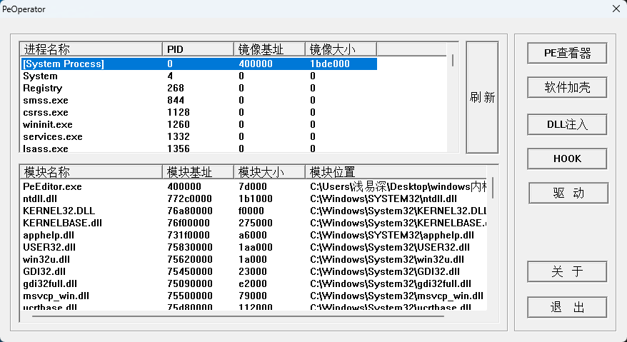

# PE工具
- 学习PE文件与win32时编写的工具，用于练习总结，目前仅支持32位程序
- 具备的功能
  - 32位PE文件结构查看
  - 32位程序dll注入，包括：远程线程注入，内存写入等注入方式
  - 软件加壳（加密壳）
  - IAT HOOK
  - 驱动加载
- 程序操作界面请移至《界面展示》文件夹

## 目录介绍
- PeEditor目录中保存的是PeEditor主程序的源码
- shell目录中保存的是“壳源”的源码

## 编译生成
- 本项目采用VC6编写，请在VC6下编译生成

## 操作界面

